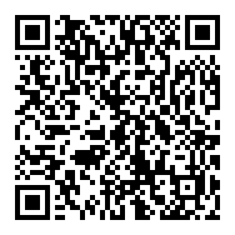

# Tarrafa

[](LICENSE)
[](SECURITY.md)
[](pyproject.toml)
[](https://github.com/Mosimann-adv/tarrafa_scraper/actions/workflows/ci.yml)
[](https://github.com/Mosimann-adv/tarrafa_scraper/actions/workflows/codeql.yml)
[](https://github.com/Mosimann-adv/tarrafa_scraper/releases)


> **Projeto experimental** — não é um produto acabado.  
> Sem SLA, sem suporte comercial, sem garantia de estabilidade ou de conformidade com qualquer caso concreto.  
> APIs e sites mudam; ferramentas quebram; **valide tudo** antes de usar em peça ou prova.  
> Detalhes de segurança e o que **não** publicar em issues: [SECURITY.md](SECURITY.md).

CLI multi-fonte **source-available** para **uso jurídico experimental**: inventário de material aberto e prova documental (páginas, feeds, prints, vídeo, Instagram, CNPJ, diário oficial/DJEN, Datajud e PDFs).
Serve para prototipar e apoiar coleta/organização de material em contexto legal — **não** é SaaS, **não** é serviço advocatício e **não** substitui análise humana.  
Independente de IDE, vault ou assistente de IA.

| | |
|--|--|
| CLI | `tarrafa` |
| Versão | 0.4.0 (experimental) |
| Python | ≥ 3.10 |
| Status | Pesquisa / protótipo — **não é produto** |
| Distribuição | Código-fonte público sob licença não comercial |
| Licença | [PolyForm Noncommercial 1.0.0](LICENSE) — créditos obrigatórios · **sem uso comercial** |

> **Você não precisa ler o README inteiro.** Escolha seu caminho:
>
> - IA com acesso ao terminal: [instalação guiada pela IA](#instalação-guiada-pela-ia).
> - Chat sem acesso ao computador: [instalação manual no Windows](#instalação-manual-no-windows).
> - Tarrafa já instalada: [primeiro uso com a IA](#primeiro-uso-com-a-ia).
> - Usuário técnico: [referência rápida](#referência-rápida).

---

## Comece aqui, mesmo sem saber programar

A Tarrafa é um programa que trabalha por comandos de texto. Você pode escrever
esses comandos, mas também pode pedir para uma IA com acesso ao terminal
executá-los por você.

Na prática, você diz algo como:

> “Use a Tarrafa para salvar o texto e tirar um print desta página. Crie uma
> pasta chamada `minha-pesquisa` e me explique o que foi encontrado.”

A IA escolhe os comandos, executa a coleta e informa onde os arquivos foram
salvos.

Você não precisa aprender Python para usar o básico. É importante apenas
entender estas três ideias:

1. **A IA precisa ter acesso ao terminal do seu computador.** Um chat comum,
   sem acesso a arquivos ou terminal, pode orientar você, mas não consegue
   instalar nem executar a Tarrafa.
2. **A Tarrafa cria arquivos no seu computador.** Ela pode gerar JSON com dados,
   PNG com prints, PDF baixado e HTML pronto para abrir ou imprimir.
3. **Você continua responsável pela conferência.** A Tarrafa é experimental;
   sites mudam, coletas podem falhar e uma IA também pode interpretar algo
   incorretamente.

### O que significa “IA com acesso ao terminal”?

É um assistente de IA instalado ou aberto dentro de um ambiente que consegue
ler a pasta do projeto e executar comandos. Se a sua IA mostrar pedidos de
permissão para usar o terminal ou alterar arquivos, leia o pedido antes de
autorizar.

Se você usa apenas um chat no navegador ou celular, peça que ele acompanhe a
[instalação manual](#instalação-manual-no-windows), copiando para o chat
qualquer mensagem de erro.

---

## Instalação guiada pela IA

Este é o caminho mais simples para quem já usa uma IA com terminal.

### 1. Abra a IA na pasta onde deseja instalar

Escolha uma pasta comum, por exemplo:

```text
C:\Users\SeuNome\Documents
```

Evite instalar dentro de pastas do sistema, como `C:\Windows` ou
`C:\Program Files`.

### 2. Envie este prompt para a IA

Copie e cole o texto abaixo:

```text
Quero instalar a Tarrafa neste computador para uso não comercial.

Repositório:
https://github.com/Mosimann-adv/tarrafa_scraper

Você tem autorização para:
1. verificar se Git e Python 3.10 ou superior estão instalados;
2. clonar o repositório nesta pasta;
3. criar um ambiente virtual chamado .venv;
4. instalar o projeto e o Chromium do Playwright;
5. executar o diagnóstico da Tarrafa.

Assim que clonar o repositório, leia o AGENTS.md antes de instalar ou executar
a Tarrafa. Não digite nem solicite minhas senhas, não configure login do
Facebook/Instagram e não altere configurações globais sem me explicar antes.
Se faltar Git ou Python, pare e me mostre o link oficial e o que preciso marcar
na instalação.

Ao final, informe:
- a pasta exata onde a Tarrafa foi instalada;
- o resultado de tarrafa doctor;
- o comando que devo usar para verificar tarrafa list;
- qualquer erro ou dependência opcional ainda ausente.
```

### 3. Confira o resultado

A instalação básica está pronta quando a IA consegue executar:

```powershell
.\.venv\Scripts\tarrafa.exe doctor
.\.venv\Scripts\tarrafa.exe list
```

O `doctor` pode avisar que programas opcionais, como `ffmpeg` ou `yt-dlp`, não
estão instalados. Isso não impede as coletas básicas de páginas e screenshots.

---

## Instalação manual no Windows

Use esta seção se a sua IA não consegue executar comandos.

### Antes de começar

Instale, pelos sites oficiais:

- [Python](https://www.python.org/downloads/) 3.10 ou superior. Durante a
  instalação, marque a opção para adicionar o Python ao `PATH`.
- [Git](https://git-scm.com/downloads), usado para baixar e atualizar o projeto.

Depois, abra o **PowerShell** dentro da pasta em que deseja guardar a Tarrafa.
Uma forma simples é abrir a pasta no Explorador de Arquivos, clicar na barra de
endereço, digitar `powershell` e pressionar Enter.

### Copie e execute um comando por vez

```powershell
git clone https://github.com/Mosimann-adv/tarrafa_scraper.git
```

```powershell
cd tarrafa_scraper
```

```powershell
py -3 -m venv .venv
```

```powershell
.\.venv\Scripts\python.exe -m pip install --upgrade pip
```

```powershell
.\.venv\Scripts\python.exe -m pip install .
```

```powershell
.\.venv\Scripts\python.exe -m playwright install chromium
```

```powershell
.\.venv\Scripts\tarrafa.exe doctor
```

```powershell
.\.venv\Scripts\tarrafa.exe list
```

Se o Windows disser que `py` não existe, feche e abra novamente o PowerShell.
Se continuar falhando, tente:

```powershell
python -m venv .venv
```

Não é necessário ativar o ambiente virtual: os exemplos acima chamam
diretamente os programas instalados dentro de `.venv`.

---

## Ensine a Tarrafa à sua IA

Dentro desta pasta, a IA aprende a Tarrafa lendo o `AGENTS.md`. **Fora dela**, não —
e é aí que a maioria dos erros acontece: a IA não encontra o comando `tarrafa`, tenta
adivinhar e acaba escrevendo o próprio scraper.

O comando abaixo resolve isso. Ele grava um arquivo de instruções nos assistentes que
encontrar instalados, já com o caminho exato da Tarrafa **nesta** máquina:

```powershell
.\.venv\Scripts\tarrafa.exe skills install
```

Antes de gravar, veja o que ele faria:

```powershell
.\.venv\Scripts\tarrafa.exe skills list
.\.venv\Scripts\tarrafa.exe skills install --dry-run
```

| Comando | O que faz |
|---------|-----------|
| `tarrafa skills list` | Mostra cada host detectado e se a skill está atualizada |
| `tarrafa skills install` | Grava nos hosts detectados |
| `tarrafa skills install --dry-run` | Mostra o que gravaria, sem gravar |
| `tarrafa skills install --dest DIR` | Grava numa pasta de skills específica |
| `tarrafa skills show` | Imprime o conteúdo, para você colar onde quiser |

Hoje ele reconhece **Claude Code** e **Grok CLI**, que usam o mesmo formato de skill.
Assistentes que leem `AGENTS.md` diretamente, como o Codex, já funcionam dentro do
repositório sem instalação nenhuma.

Três coisas que valem saber:

1. **O comando escreve fora do repositório**, na pasta de configuração do assistente.
   Por isso ele é um passo separado e explícito — a instalação da Tarrafa não mexe
   nessas pastas sozinha.
2. **Ele não apaga skill que você escreveu à mão.** Se o arquivo existir e não tiver
   sido gerado pela Tarrafa, o comando pula e avisa. Use `--force` para substituir.
3. **Reinstale depois de atualizar a Tarrafa.** A skill descreve as flags da versão que
   a gerou; `tarrafa doctor` avisa quando ela fica para trás.

---

## Primeiro uso com a IA

Abra a IA dentro da pasta `tarrafa_scraper` e envie um dos prompts abaixo.

### Capturar uma página pública

```text
Leia o AGENTS.md e use a Tarrafa já instalada nesta pasta.

Capture o texto e os dados públicos desta URL:
https://example.com

Salve tudo dentro de uma nova pasta chamada minha-primeira-coleta.
Use o CLI da Tarrafa, não escreva outro scraper.

Ao terminar, informe:
- o comando executado;
- o exit code;
- os arquivos criados;
- a quantidade de itens;
- os erros ou limitações da coleta;
- um resumo simples do conteúdo encontrado.
```

### Tirar um print de uma página

```text
Use a Tarrafa para tirar um screenshot de página inteira desta URL:
COLE_A_URL_AQUI

Salve em ./minha-primeira-coleta/shots com o identificador PAGINA01.
Não sobrescreva arquivos existentes. Ao final, mostre o caminho do PNG e do
JSON de metadados e diga se a captura terminou sem erros.
```

### Consultar um CNPJ

```text
Use tarrafa cnpj para consultar o CNPJ 00.000.000/0001-91.
Salve o resultado em ./minha-primeira-coleta/cnpj.json.
Não invente informações e diferencie claramente dado encontrado, ausência de
dado e erro da fonte.
```

### Organizar várias coletas em uma pasta

```text
Crie um workspace Tarrafa chamado pesquisa-exemplo.
Depois use tarrafa doctor e me mostre quais pastas foram criadas.
Não faça nenhuma coleta ainda.
```

### Pedir ajuda quando algo falhar

```text
A execução da Tarrafa falhou. Leia toda a mensagem abaixo, execute primeiro
apenas verificações que não alterem meus arquivos e explique o problema em
linguagem simples.

Depois proponha a correção mais segura e peça autorização antes de instalar
algo novo ou apagar arquivos.

MENSAGEM DE ERRO:
COLE_AQUI_A_MENSAGEM_COMPLETA
```

Nos prompts, substitua `COLE_A_URL_AQUI` e os dados de exemplo pelos dados que
você realmente quer pesquisar.

### Modelo para qualquer pedido

Quando não houver um exemplo pronto, use este formato:

```text
Leia o AGENTS.md e use o CLI da Tarrafa disponível nesta pasta.

Objetivo:
DESCREVA_O_QUE_VOCÊ_QUER_COLETAR

Fontes ou dados de entrada:
COLE_AS_URLS_OU_DADOS_AQUI

Pasta de saída:
./minha-pesquisa

Regras:
- não invente dados nem substitua a Tarrafa por outro scraper;
- não sobrescreva arquivos existentes;
- não faça login nem solicite senhas;
- diferencie resultado encontrado, lacuna e erro;
- ao terminar, informe comandos, exit codes, arquivos, contagens e limitações;
- explique o resultado final em linguagem simples.
```

---

## Entendendo os arquivos criados

| Extensão | O que é | Como abrir |
|----------|----------|------------|
| `.json` | Dados estruturados, fontes, horários, erros e notas | Peça para a IA resumir ou abra em editor de texto |
| `.png` | Screenshot da página | Fotos, navegador ou visualizador de imagens |
| `.html` | Relatório ou álbum autocontido | Navegador; também pode imprimir em PDF |
| `.pdf` | Documento baixado da fonte | Leitor de PDF |

O JSON comum da Tarrafa registra a fonte consultada, o horário da coleta, o
método usado, os itens encontrados, erros e observações. Capturas e vídeos
também podem registrar SHA-256, uma impressão digital usada para conferir se o
arquivo mudou.

Veja um [artefato de exemplo](examples/page_capture.example.json).

---

## Cuidados importantes

- Não cole senhas em prompts, comandos, arquivos `.env` ou issues do GitHub.
- Não envie `storage_state.json` para outras pessoas: ele pode conter uma sessão
  autenticada.
- Não peça para a IA automatizar login do Facebook ou recuperação de senha.
- Diga sempre em qual pasta a IA deve salvar os resultados.
- Use `--no-clobber` quando não quiser sobrescrever arquivos existentes.
- Confira os arquivos e as fontes antes de usar qualquer resultado como prova.
- A licença padrão permite uso **não comercial**. Uso profissional ou comercial
  pode exigir autorização específica; consulte a seção [Licença](#licença).

---

## Referência rápida

Se a Tarrafa estiver instalada na `.venv` local, uma IA no Windows pode usar
`.\.venv\Scripts\tarrafa.exe`. Com o ambiente virtual ativado ou o programa
instalado no sistema, o comando curto é apenas `tarrafa`.

Fluxo típico:

1. **Checar o ambiente:** `tarrafa doctor`.
2. **Opcionalmente criar uma pasta de trabalho:**

   ```bash
   tarrafa init ./meu-caso --name "Meu caso"
   ```

   Isso cria `tarrafa.toml` e as pastas `raw/`, `shots/`, `html/`, `logs/` e
   `meta/runs/`. O workspace é opcional: também é possível gravar em qualquer
   caminho informado por `--out` ou `--out-dir`.

3. **Escolher a ferramenta e indicar onde salvar:**

| Quero… | Comando base |
|--------|--------------|
| Descobrir URLs na internet | `tarrafa search --query '"Nome" cidade' --out ./raw/search.json` |
| Aprofundar perfil, site próprio e artigos | `tarrafa profile --name "Nome" --from-agent ./repasse.json --out-dir ./raw/profile` |
| Texto e dados de uma URL | `tarrafa page --url URL --out ./raw/page.json` |
| Várias URLs de uma vez | `tarrafa page --urls-file urls.txt --out ./raw/pages/` |
| Print de tela | `tarrafa shot --url URL --out-dir ./shots --id DOC01` |
| Comentários de post no Instagram | `tarrafa ig --url POST_URL --out ./raw/ig.json --storage-state ./storage_state.json --headed` |
| Consultar CNPJ | `tarrafa cnpj --cnpj 00.000.000/0001-91 --out ./raw/cnpj.json` |
| Diário por advogado | `tarrafa djen --oab 12345 --uf SP --out ./raw/djen.json` |
| Diário por parte | `tarrafa djen --papel parte --cpf "<CPF>" --out ./raw/djen.json` |
| Processo por CNJ | `tarrafa datajud --cnj … --out ./raw/datajud.json` |
| Inteiro teor do STJ | `tarrafa stj --warmup --headed --save-storage ./stj.json` |
| Extrair texto de PDFs | `tarrafa pdf-extract --dir ./pdfs --recursive --out ./raw/pdf.json` |
| Álbum ou ficha para impressão | `tarrafa album …` / `tarrafa dossier …` |

Ajuda de cada ferramenta:

```bash
tarrafa list
tarrafa page --help
tarrafa shot --help
```

Flags globais aparecem antes do nome da ferramenta:

```bash
tarrafa --workspace ./meu-caso -v page --url https://example.com --out raw/page.json
tarrafa --no-clobber page --url URL --out raw/page.json
tarrafa --force page --url URL --out raw/page.json
```

Com workspace ativo, cada execução grava histórico em
`meta/runs/<run_id>.json`, com argumentos sanitizados, artefatos, SHA-256 e exit
code.

Configuração em camadas: flags → env (`TARRAFA_TIMEOUT`, …) →
`./tarrafa.toml` → `~/.tarrafa/config.toml`.

### O que precisa ser configurado

| Recurso | Responsável |
|---------|-------------|
| Python 3.10+, dependências e Chromium | Computador de quem usa |
| Sessão Instagram (`storage_state.json`) | Login nativo de cada usuário; nunca compartilhe o arquivo |
| `DATAJUD_API_KEY` | Opcional; se usada, deve ficar no `.env` local |
| `BRAVE_SEARCH_API_KEY` ou `SEARXNG_URL` | Opcionais; apenas para busca executada dentro do CLI |
| Token Playwright MCP | Opcional (só host/IDE com extension); coletas usam o **CLI** + `storage_state` |

**Não** digite senha no CLI. **Não** automatize Facebook OIDC. Os arquivos são
gravados no caminho informado pelo usuário.

---

## Ferramentas

| Comando | Função |
|---------|--------|
| `tarrafa init` | Cria workspace opcional (`tarrafa.toml` + pastas) |
| `tarrafa ig` | Comentários Instagram → JSON com permalink `/c/{id}/` |
| `tarrafa search` | Busca web → URLs candidatas com proveniência |
| `tarrafa profile` | Descoberta iterativa → candidatos, sites, artigos e cobertura |
| `tarrafa page` | Uma URL pública → texto + facts (meta / JSON-LD) |
| `tarrafa site` | Crawl concorrente same-host (max pages / depth) |
| `tarrafa feed` | RSS/Atom → envelope de entradas |
| `tarrafa shot` | Screenshot de alta qualidade (PNG + JSON) |
| `tarrafa video` | Meta de vídeo + frames (+ download opcional via yt-dlp) |
| `tarrafa album` | Compila shots/frames em HTML pronto para impressão |
| `tarrafa dossier` | Ficha HTML: avatar + achados + fontes + prints seletivos |
| `tarrafa cnpj` | Consulta CNPJ via API open CNPJá (sem API key) |
| `tarrafa djen` | Comunicações DJEN — advogado (`--oab`) ou parte (prioridade por `--cpf`) |
| `tarrafa datajud` | Capa/movimentos Datajud por CNJ |
| `tarrafa stj` | Inteiro teor STJ/SCON (PDF; sessão headed/CDP se Cloudflare) |
| `tarrafa pdf-extract` | Texto + identity hints de PDFs |
| `tarrafa order-risk` | Triagem chargeback e-commerce (JSON + HTML com imagens embutidas) |
| `tarrafa doctor` | Checa deps, Chromium, ffmpeg, yt-dlp, session e env |
| `tarrafa list` / `version` | Lista tools / versão |

---

## Instalação

### Uso

Instalação a partir do código:

```bash
git clone https://github.com/Mosimann-adv/tarrafa_scraper.git
cd tarrafa_scraper
python -m venv .venv

# Windows
.\.venv\Scripts\Activate.ps1

# macOS / Linux
# source .venv/bin/activate

python -m pip install .
python -m playwright install chromium
tarrafa doctor
```

Instalação direta da release:

```bash
python -m pip install \
  https://github.com/Mosimann-adv/tarrafa_scraper/releases/download/v0.4.0/tarrafa_scraper-0.4.0-py3-none-any.whl
python -m playwright install chromium
tarrafa doctor
```

Extras opcionais:

```bash
python -m pip install ".[av]"     # yt-dlp (download de vídeo)
python -m pip install ".[site]"   # scrapy opcional; site usa httpx assíncrono por padrão
# ffmpeg no PATH → frames a partir do arquivo baixado
```

### Desenvolvimento

```bash
python -m pip install -e ".[dev]"
python -m playwright install chromium
ruff check src tests
pytest -q -m "not integration"
pytest -q -m integration  # rede e Chromium
```

---

## Exemplos

### Descoberta web

A descoberta é feita, por padrão, com as ferramentas disponíveis no ambiente de quem
orquestra. Registre consultas, resultados e descartes em um repasse:

```json
{
  "agent": "quem buscou",
  "note": "URLs descartadas e motivos, ou declaração de que não houve descartes",
  "queries": [
    {
      "query": "\"Nome Completo\" cidade profissão",
      "results": [{"url": "https://example.com/perfil", "title": "Perfil"}]
    }
  ]
}
```

```bash
# caminho padrão: registra, canoniza e deduplica a descoberta externa
tarrafa search --from-agent ./repasse.json \
  --urls-out ./out/urls.txt --out ./out/search.json

# captura determinística dos candidatos encontrados
tarrafa page --urls-file ./out/urls.txt --out ./out/pages/

# opcional: busca dentro do CLI para quem já tem Brave ou SearXNG
tarrafa search --query '"Nome Completo" cidade profissão' \
  --urls-out ./out/urls.txt --out ./out/search.json

tarrafa search --queries-file ./consultas.txt --max-results 30 \
  --urls-out ./out/urls.txt --out ./out/search.json
```

Brave e SearXNG não são pré-requisitos e não devem ser sugeridos por padrão. Resultados
são candidatos, não confirmação de identidade. CPF, e-mail e telefone são bloqueados
quando a busca ocorre dentro do CLI; `--allow-sensitive-query` exige decisão explícita.
A IA é opcional: `search` não chama modelo nem exige credencial de provedor de IA.

### Descoberta aprofundada de perfil

`profile` transforma a busca pontual em um ciclo verificável: combina nome, handle,
profissão, local e palavras-chave; pontua candidatos; abre páginas públicas; cria
consultas de segundo nível por domínio; percorre sites candidatos, sitemap e áreas de
artigos; e registra cobertura e lacunas em `profile.json`. Uma ficha navegável
`profile.html` é gerada por padrão no mesmo diretório.

```bash
# sem provedor próprio: a busca do ambiente entra pelo repasse
tarrafa profile --name "Marina Alves" --handle "@marinaalves" \
  --profession "arquiteta" --keyword "urbanismo" \
  --from-agent ./repasse.json --out-dir ./out/profile

# com Brave ou SearXNG já configurado: as rodadas seguintes rodam no CLI
tarrafa profile --name "Marina Alves" --profession "arquiteta" \
  --location "Curitiba" --out-dir ./out/profile

# integração puramente estruturada, sem HTML
tarrafa profile --name "Marina Alves" --from-agent ./repasse.json \
  --out-dir ./out/profile --no-html
```

Sem provedor, `queries_followup.txt` registra as consultas adicionais que ainda precisam
ser executadas e reapresentadas numa nova coleta. O comando nunca usa CPF, e-mail ou
telefone como consulta; aceita apenas páginas públicas e não confirma sozinho que um site
ou artigo pertence à pessoa. Use `--html-out CAMINHO` para escolher outro destino. O
comando inclui no inventário publicações externas capturadas, sem misturá-las com conteúdo
do domínio próprio e mantendo a relação como candidata.

### Página

```bash
tarrafa page --url https://example.com --out ./out/page.json

# batch (um URL por linha; # comentários ok)
tarrafa page --urls-file ./urls.txt --out ./out/pages/ --mode http
```

Além do corpo do artigo, colhe **meta/OG**, **JSON-LD** e contadores embutidos (`structured_facts`, `text_main` = corpo puro).
No modo padrão `auto`, tenta HTTP primeiro e abre o navegador no máximo uma vez
quando detecta página dinâmica ou captura insuficiente. Se o navegador produzir
um resultado pior, a captura HTTP é preservada.

### Screenshot + álbum

```bash
# recorte do conteúdo principal
tarrafa shot --url https://example.com --out-dir ./out/shots --id EX01 --clip main --dpr 2

# batch
tarrafa shot --urls-file ./urls.txt --out-dir ./out/shots --clip main --dpr 1

# página inteira
tarrafa shot --url https://example.com --out-dir ./out/shots --id EX01b --clip page --full-page

# seletor CSS
tarrafa shot --url https://example.com --out-dir ./out/shots --id EX01c --selector "article"

tarrafa album --dir ./out/shots --out ./out/shots/album.html \
  --title "Álbum de capturas" \
  --kicker "Inventário visual" \
  --meta "Assunto: …" \
  --meta "Data: …"
```

HTML no estilo inventário (folha A4, botão Imprimir/PDF).  
**Embed por padrão** (base64) → um único `.html` portátil. Relativo: `--no-embed`.

### Ficha / dossiê

Renderiza overview a partir de fatos e arquivos **já capturados** (não busca na web).

```bash
tarrafa dossier \
  --title "Nome Completo" \
  --subtitle "Âncora · cidade" \
  --out ./perfil/ficha.html \
  --avatar ./perfil/foto.png \
  --meta "Nome: …" --meta "Cidade: …" \
  --fact "Achado factual (fonte citada)" \
  --source "Fonte | https://… | nota" \
  --timeline "2022 | Vínculo em …" \
  --shot "print1=./shots/print.png::Legenda" \
  --gap "O que não foi validado" \
  --chip "âncora curta"
```

- **`--fact` / `--source` / `--timeline`**: conteúdo e inventário de fontes; prints são opcionais e seletivos.
- **`--manifest dossier.json`**: seções ricas (`sections[]`, cards, tabelas).

### CNPJ / DJEN / Datajud / PDF

```bash
tarrafa cnpj --cnpj 00.000.000/0001-91 --out ./out/cnpj.json

# Advogado: diário por OAB + UF
tarrafa djen --oab 12345 --uf SP --max-items 100 --out ./out/djen.json

# Parte: CPF é a âncora prioritária e recebe conferência exata local
tarrafa djen --papel parte --cpf "<CPF>" --max-items 50 --out ./out/djen_cpf.json

# Parte sem CPF: busca por nome estruturado ou texto/handle
tarrafa djen --papel parte --nome "Nome Completo" --max-items 50 --out ./out/djen_parte.json

# Parte + Datajud em cadeia (CNJs encontrados)
tarrafa djen --papel parte --cpf "<CPF>" --follow-datajud \
  --datajud-out ./out/datajud.json --max-cnj 15 --out ./out/djen.json

tarrafa datajud --cnj 0000000-00.0000.0.00.0000 --out ./out/datajud.json
# opcional: --tribunal trf4 | env DATAJUD_API_KEY

# STJ inteiro teor (SCON) — 1) aquecer sessão  2) baixar
tarrafa stj --warmup --headed --save-storage ./stj_storage.json
tarrafa stj --num-registro 201600461292 --dt-publicacao 23/08/2019 \
  --storage-state ./stj_storage.json --out-dir ./out/stj_pdfs --out ./out/stj.json --extract
# lote: linhas "num|dd/mm/aaaa" ou URL GetInteiroTeor
tarrafa stj --urls-file ./seeds_stj.txt --storage-state ./stj_storage.json \
  --out-dir ./out/stj_pdfs --out ./out/stj.json

tarrafa pdf-extract --dir ./out/pdfs --recursive --out ./out/pdf_extract.json
```

- **cnpj:** open CNPJá sem API key; não busca por nome de sócio.
- **djen advogado:** amostra + pós-filtro OAB.
- **djen parte:** havendo CPF, use `--cpf`; ele prevalece sobre `--nome`/`--texto` e cada
  resultado passa por conferência exata local. Sem CPF, use `--nome` ou `--texto`;
  `identity_hints` permanece heurístico e nomes curtos não devem fundir homônimos.
- **datajud:** índice típico **sem** partes — use CNJs já conhecidos.
- **stj:** SCON costuma exigir desafio Cloudflare; não contorna captcha — use `--warmup --headed` ou `--cdp`. Exit **5** = challenge.
- **pdf-extract:** texto embutido (pypdf); PDF só-imagem precisa OCR externo.
- **Perfil de pessoa (orquestração):** `docs/PROFILE_PIPELINE.md` — djen parte, autos, IG shots, homônimo/CPF, V1 HTML vs anexo judicial.

### Vídeo

```bash
tarrafa video --url https://example.com/video --out-dir ./out/vid --id VID01 --frames 5
tarrafa video --url "URL" --out-dir ./out/vid --id VID01 --download --frames 5
tarrafa album --dir ./out/vid --out ./out/vid/album.html --title "Frames de vídeo"
```

### Site / feed / Instagram

```bash
tarrafa site --url https://example.com --out ./out/site.json --max-pages 15 --max-depth 2
tarrafa feed --url https://example.com/feed.xml --out ./out/feed.json --max-entries 20

# IG: login nativo uma vez (nunca Facebook OIDC / senha automatizada)
tarrafa ig --url https://www.instagram.com/accounts/login/ --headed --max-comments 0 \
  --save-storage ./storage_state.json --out ./_login_dummy.json
tarrafa ig --url https://www.instagram.com/p/SHORTCODE/ --out ./comments.json \
  --storage-state ./storage_state.json --expand-replies --headed
```

O crawl reutiliza uma sessão HTTP assíncrona com concorrência conservadora,
retries transitórios e processamento em ordem BFS.

---

## Envelope comum

Campos: `tool`, `version`, `collected_at`, `source`, `meta`, `count`, `items[]`, `errors[]`, `notes[]`.

Shot/video gravam mídia em `--out-dir` e JSON com `sha256`.

---

## Agentes de IA

Contrato em **`AGENTS.md`**: preferir o CLI; não digitar senha; saída no diretório que o usuário indicar; material-only (captura, sem classificar).

---

## Estrutura

```
tarrafa_scraper/
  src/tarrafa/
    cli.py
    core/           # envelope, writers, http, extract, crawl, media, doctor
    templates/      # HTML album / dossier
    tools/          # ig, page, site, feed, shot, video, album, …
  tests/
  docs/
```

---

## Config e segurança

- `storage_state.json` e `.env` estão no `.gitignore` — não commitar.
- Env carregado no startup (sem sobrescrever variáveis já no processo):
  1. `~/.tarrafa/.env` (user-global)
  2. `<repo>/.env` (projeto)
- Coletas (IG, shot, STJ, …) passam pelo **CLI `tarrafa`**, não pelo Playwright MCP.
- Token opcional da extensão Playwright MCP (host/IDE; o CLI não depende dele):

```env
PLAYWRIGHT_MCP_EXTENSION_TOKEN=seu_token_aqui
```

O token é específico do perfil atual do Chrome/Edge: copie o valor exibido pela extensão
nesse mesmo perfil, mantenha uma única cópia preferencial em `~/.tarrafa/.env` e reinicie
o servidor/cliente MCP depois de alterar. `tarrafa doctor` compara apenas as cópias locais
por fingerprint; ele não valida a conexão viva com a extensão.

Template: `.env.example`. Conferir com `tarrafa doctor` (token mascarado + `storage_state`).

Uso lícito e prova apenas; respeitar ToS e lei local. O Tarrafa **não** presta serviço advocatício nem substitui análise jurídica humana.

Ver também **[SECURITY.md](SECURITY.md)** (o que não vazar em issues; tokens; relatório de vulnerabilidade).

---

## Licença

Distribuído sob **[PolyForm Noncommercial License 1.0.0](LICENSE)**.

Como a licença restringe uso comercial, o Tarrafa é **source-available**, não
open source no sentido OSI. A expressão SPDX do pacote é
`PolyForm-Noncommercial-1.0.0`.

Em resumo (não substitui o texto integral):

| | |
|--|--|
| **Pode** | Usar, estudar, modificar e redistribuir para fins **não comerciais**, com os avisos de licença |
| **Deve** | Manter os **créditos** / `Required Notice` e a licença junto com as cópias |
| **Não pode** | Uso **comercial** (incluindo exploração paga do software sem autorização à parte) |
| **Garantia** | Nenhuma — software “as is”, experimental |

Uso em atividade econômica / escritório como produto ou serviço costuma ser **comercial** sob esta licença. Para licença comercial ou autorização específica, fale com o mantenedor.

Isto **não** transforma o Tarrafa em produto suportado: mesmo com permissão, o código permanece experimental.

> Required Notice: Copyright Mosimann Advocacia / Tarrafa contributors  
> Project: Tarrafa — https://github.com/Mosimann-adv/tarrafa_scraper

---

## Apoie o projeto

Se o Tarrafa for útil no seu fluxo (estudo, pesquisa, prototipagem não comercial), uma doação voluntária via **Pix** ajuda a manter o projeto.

| | |
|--|--|
| Chave Pix | `mosimannadv@gmail.com` |
| Tipo | E-mail |



Doação voluntária; **sem** contraprestação de serviço advocatício.
